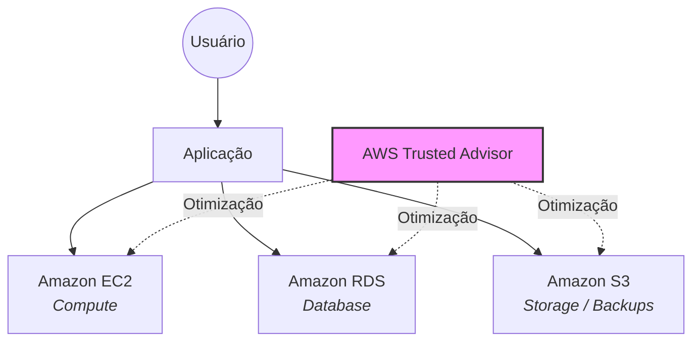

# Relatório de Implementação de Serviços AWS

**Data:** 20/01/2026  
**Empresa:** Abstergo Industries  
**Responsável:** Matheus Jesus

---

## 📘 Introdução

Este documento descreve o processo de **implementação estratégica de serviços da Amazon Web Services (AWS)** na empresa **Abstergo Industries**. O projeto teve como objetivo principal a **redução imediata de custos operacionais**, mantendo níveis adequados de desempenho, segurança e disponibilidade do ambiente em nuvem.

Para isso, foram selecionados três serviços amplamente utilizados em ambientes corporativos — **Amazon EC2, Amazon RDS e Amazon S3** — aplicando boas práticas recomendadas pela AWS para otimização de recursos e eliminação de desperdícios.

---

## 🛠️ Descrição do Projeto

A implementação foi organizada em **três etapas**, cada uma focada em um componente específico da infraestrutura em nuvem, visando ganhos financeiros rápidos e sustentáveis.

---

### 🔹 Etapa 1 — Amazon EC2

**Foco:** Computação em nuvem com eficiência operacional e controle de custos

**Caso de uso:**  
O Amazon EC2 foi utilizado para hospedar a aplicação corporativa. Inicialmente, realizou-se uma análise detalhada do consumo de CPU, memória e tempo de execução das instâncias. A partir disso, aplicou-se o conceito de *rightsizing*, ajustando os tipos de instância à carga real de uso.

Além disso, ambientes não produtivos foram configurados para desligamento automático fora do horário comercial, reduzindo custos desnecessários com computação.

---

### 🔹 Etapa 2 — Amazon RDS

**Foco:** Banco de dados relacional gerenciado com menor custo operacional

**Caso de uso:**  
O Amazon RDS foi adotado para o gerenciamento do banco de dados da aplicação, eliminando tarefas manuais de manutenção de servidores. Foram selecionadas classes de instância compatíveis com a demanda real do sistema, além da configuração de backups automáticos e armazenamento escalável.

Essa abordagem garantiu maior confiabilidade dos dados, simplicidade operacional e controle financeiro eficiente.

---

### 🔹 Etapa 3 — Amazon S3

**Foco:** Armazenamento de objetos com otimização de custos

**Caso de uso:**  
O Amazon S3 foi implementado para armazenamento de arquivos estáticos, documentos e backups. Para maximizar a eficiência financeira, foram configuradas **políticas de ciclo de vida**, permitindo a transição automática de dados pouco acessados para classes de armazenamento mais econômicas.

Essa estratégia reduziu os custos de armazenamento a médio e longo prazo, sem impacto na disponibilidade das informações.

---

## ✅ Conclusão

A implementação dos serviços AWS proporcionou à **Abstergo Industries** maior controle sobre o uso da infraestrutura, eliminação de recursos subutilizados e **redução significativa dos custos operacionais**.

O ambiente passou a ser mais **organizado, escalável e financeiramente sustentável**, alinhado às necessidades atuais do negócio. Recomenda-se a continuidade do monitoramento dos recursos e a adoção de novas soluções AWS que possam ampliar os benefícios alcançados.

---

# 📎 Anexos

## 📊 Anexo A — Relatórios de Análise de Custos da AWS

### Resumo de Custos (Antes x Depois)

| Serviço | Situação Inicial (R$) | Situação Após Otimização (R$) | Ação Aplicada | Impacto |
| :--- | :--- | :--- | :--- | :--- |
| **EC2** | 1.200,00 | 750,00 | Rightsizing + desligamento automático | `-37,5%` |
| **RDS** | 600,00 | 420,00 | Ajuste de classe + armazenamento escalável | `-30%` |
| **S3** | 300,00 | 180,00 | Políticas de ciclo de vida | `-40%` |
| **Total** | **2.100,00** | **1.350,00** | — | **-35,7%** |

> [!NOTE]
> **Observações:**
> * Os valores são estimativas baseadas no uso mensal do ambiente.
> * A análise foi realizada com base em métricas de consumo e recomendações do **AWS Trusted Advisor**.

---

## ⚙️ Anexo B — Registros das Configurações Aplicadas

#### 🖥️ Amazon EC2
- Redimensionamento de instâncias para tipos adequados à carga real.
- Desligamento automático de ambientes não produtivos fora do horário comercial.
- Remoção de instâncias ociosas identificadas pelo Trusted Advisor.

#### 🗄️ Amazon RDS
- Seleção de classe de instância compatível com a demanda.
- Ativação de backups automáticos.
- Configuração de armazenamento escalável.

#### 📦 Amazon S3
- Criação de buckets para arquivos estáticos e backups.
- Aplicação de políticas de ciclo de vida.
- Transição automática para classes de armazenamento de menor custo.

---

## 🗺️ Anexo C — Diagrama da Arquitetura do Ambiente

Descrição do Diagrama:

A aplicação é hospedada em instâncias EC2.

O banco de dados é gerenciado pelo Amazon RDS.

Arquivos e backups são armazenados no Amazon S3.

O AWS Trusted Advisor fornece recomendações contínuas para otimização e boas práticas.

---

**Assinatura do Responsável pelo Projeto**  
Matheus Jesus
